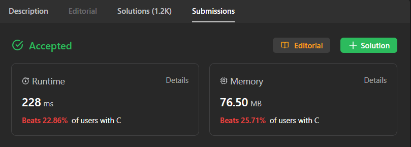

# Exercícios Resolvidos de Juiz Online

Tema:

- D&C

## Alunos

| Matrícula  | Aluno                       |
| ---------- | --------------------------- |
| 19/0085045 | Brenno da Silva Oliveira    |
| 19/0087501 | Gabriel Marcolino Rodrigues |

## Sobre

Resolução dos exercícios do LeetCode.

> [4 - Median of Two Sorted Arrays](https://leetcode.com/problems/median-of-two-sorted-arrays/description/) 
> [493 - Reverse Pairs](https://leetcode.com/problems/reverse-pairs/description/) 
> [315 - Count of Smaller Numbers After Self](https://leetcode.com/problems/count-of-smaller-numbers-after-self/description/) 
> [148 - Sort List](https://leetcode.com/problems/sort-list/description/) 

## Screenshots

### 4 - Median of Two Sorted Arrays

### 493 - Reverse Pairs

### 315 - Count of Smaller Numbers After Self

### 148 - Sort List

## Instalação

**Linguagem**: C

## Uso

Para rodar os exercícios basta clonar o respositório

    git clone git@github.com:projeto-de-algoritmos/DividirConquistar_ExerciciosJuizOnline.git

E executar os seguintes comandos dentro da pasta do arquivo pelo terminal:

    gcc -o nome_arquivo nome_arquivo.c

 

    ./nome_arquivo.exe < nome_arquivo.txt

Outra forma é subtmeter os códigos dos exercícios pelo juiz online:

- [4 - Median of Two Sorted Arrays](https://leetcode.com/problems/median-of-two-sorted-arrays/)
- [493 - Reverse Pairs](https://leetcode.com/problems/reverse-pairs/)
- [315 - Count of Smaller Numbers After Self](https://leetcode.com/problems/count-of-smaller-numbers-after-self/)
- [148 - Sort List](https://leetcode.com/problems/sort-list/)

## Outros

[Vídeo de apresentação]()
